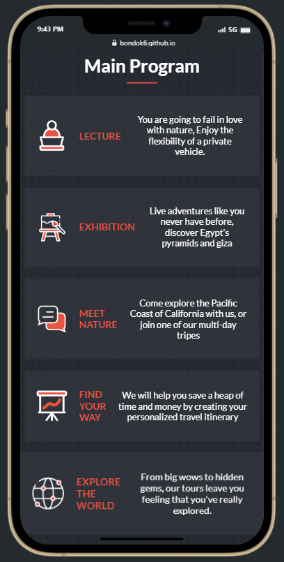
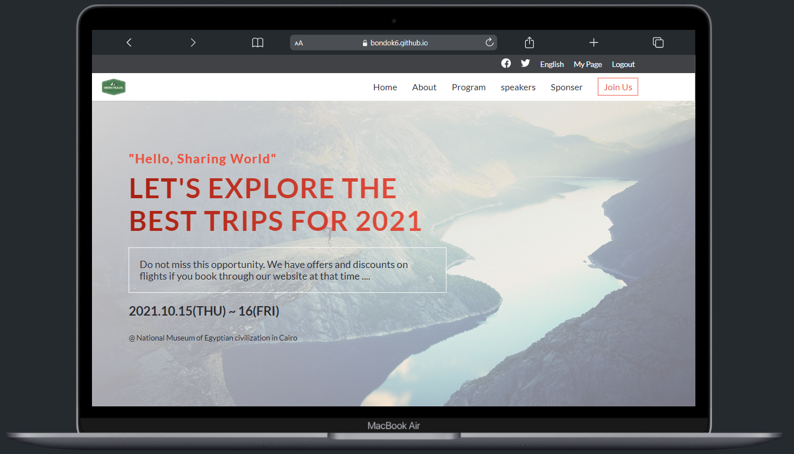

# Green-Travel

> ### This is a website for tourism and traveling around the world, exploring the world, and offering exciting tours for adventurers.

## Built With

- HTML - HTML5
- CSS - CSS3

## Additional tools

- Google fonts
- Behance

## Live Demo

[Kyrillos's Portfolio](https://bondok6.github.io/Green-Travel/)

## Getting Started

To get a local copy up and running follow these simple example steps.

`git clone git@github.com:Bondok6/Green-Travel.git`

## Authors

👤 **Author1**

- GitHub: [@Bondok6](https://github.com/Bondok6)
- LinkedIn: [LinkedIn](https://linkedin.com/in/linkedinhandle)

## 🤝 Contributing

Contributions, issues, and feature requests are welcome!

Feel free to check the [issues page](../../issues/).

## Show your support

Give a ⭐️ if you like this project!

## 📝 License

This project is [MIT](./MIT.md) licensed.
